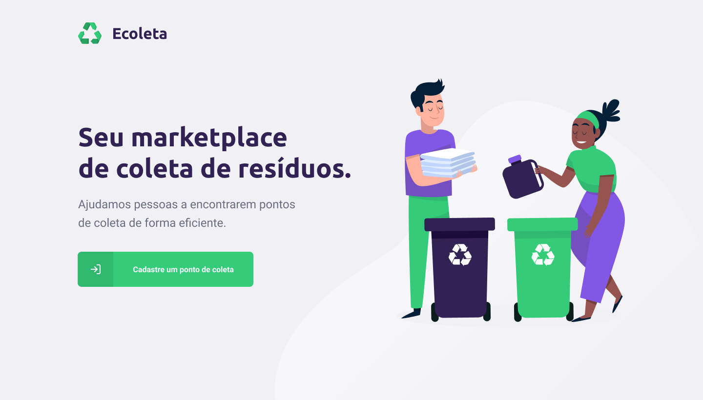
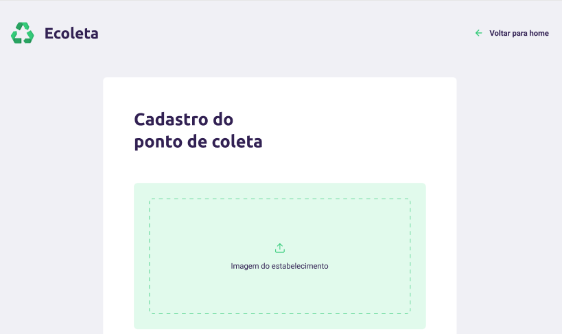
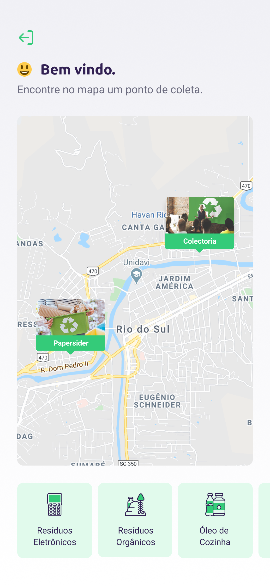
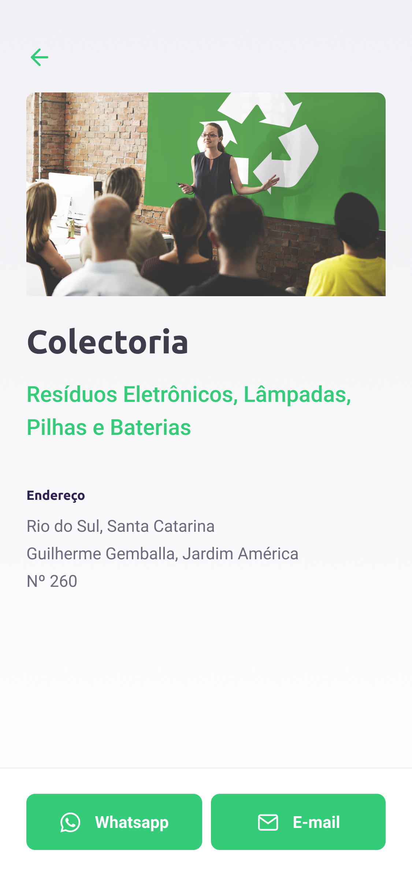

<h1 align="center">
    
</h1>

## Aplicação feita através da Next Level Week 1, provida pela empresa Rocketseat, utilizando as seguintes tecnologias em nível intermediário: Typescript, React, React Native, SQLite.

 

  

## 🚀 Tecnologias

Esse projeto foi desenvolvido com as seguintes tecnologias:

- [Typescript]
- [React]
- [React Native]
- [SQLite]
- [Express]

## 💻 Projeto

O Ecoleta é um marketplace que ajuda pessoas a encontrarem pontos de coleta de resíduos de forma eficiente.

 
 
O projeto funciona de modo que a entidade que detém o ponto de coleta se cadastre por meio da aplicação web e pessoas ou outras entidades interessadas na coleta de resíduos encontrem este ponto através da aplicação mobile (no mapa), tendo também a possibilidade de entrar em contato através do E-mail ou WhatsApp para melhores informações.

 

## Telas da Aplicação Web: 

### Tela Home:

 

 

### Tela de cadastro dos pontos de coleta:

 

 

## Telas da Aplicação Mobile:

 

### Tela de Início:

 

 

### Tela Home:

 

### Tela de detalhes do estabelecimento:

 

